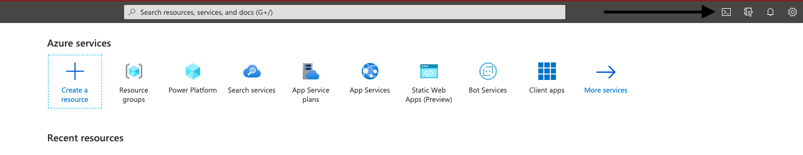
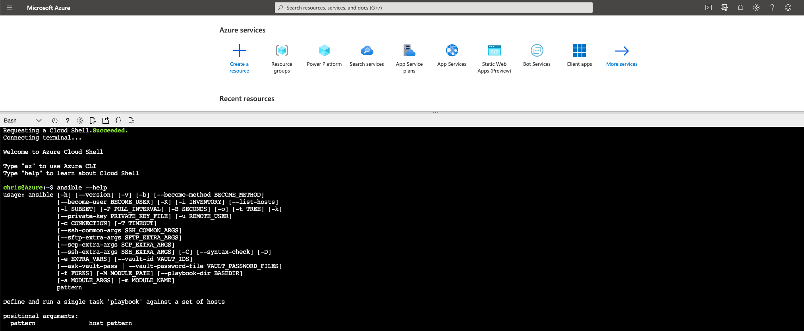

# AzureSecurityBaseline
Azure Security Baseline

Welcome to Our Demo of Ansible on Azure. 
    - What is Ansible
    - The basics of writing a playbook
    - How to use Azure Resource Manager 
    - Using Azure Resource Manager to handle templetes in Ansible. 

We are going to Use Red Hat Software Ansible to help with the Security Baseline Deployment & AZ-500 Deployment. 

Login to your Azure infrastructure & open up and AzureCLI. 



After you click the shell you need to ensure it is in bash. You will see the following. Ansible is already installed.  



I am going to Break Down as sample oh an Ansible YAML File

``` 
- name: setup system 
# Above is a name comment and can be named whatever you would like

  hosts: localhost
# the Hosts: is an indication of were ansible is going to run the commands from. In this scenario we are going to run it right from the AzureCLI

  tasks:
# Everything Below this task line will be indented as it will be nested under Tasks. 

   - name: azure create resource group
# the name once again can be whichever we would like to help us understand what is happening later on

     azure_rm_deployment:
     # this task above is the Azure Resource Manager and can be used to help manage your azure infrastructure

         resource_group: aztestsynnex
     # this will be the name of the test resource group we are going to create
         location: east US
     
         state: present
     # we can use another flag as present to create and is idempotent and will not be able to be ran if another is present or we can run absent to remove the azure Resource Group altogether. 
        
```         

and create a file .yml and include the following text. I have also already completed them within this repo for you. 

 ``` 
- name: setup system

  hosts: localhost

  tasks:

   - name: azure create

     azure_rm_deployment:

         resource_group: AZ500mod2lab2

         location: east US

         state: present

         name: az500mod2lab2

         template_link: 'https://raw.githubusercontent.com/MicrosoftLearning/AZ-500-Azure-Security/master/Allfiles/Labs/Mod2_Lab02/template.json'
```
         

The Second File Below is AZ Security Baseline and includes the ability to pass parameters.


<div class="yaml"> 

```

- name: Ansible prereqs 

  hosts: localhost

  tasks:

   - name: azure create 
#Azure Resource Manager Deployment
     azure_rm_deployment:

         resource_group: resourcetempl

         location: east US

         state: present

         name: resourcetempl

         template_link: 'https://raw.githubusercontent.com/microsoft/MCW-Security-baseline-on-Azure/master/Hands-on%20lab/AzureTemplate/template.json'

         parameters:

              adminUsername:

                      value: wsadmin

             adminPassword:

                      value: p@ssword1rocks

             databaseName:

                      value: microsoftbaselinesecurity

             userObjectId:

                     value: 

             vmSize:

                     value: Standard_E2s_v3

             sqlservername:

                     value: synnexdbtest1     

```
</div>

The next set of inscrutions are located here for the AZ Security Baseline. 


https://github.com/microsoft/MCW-Security-baseline-on-Azure/blob/master/Hands-on%20lab/Before%20the%20HOL%20-%20Security%20baseline%20on%20Azure.md#task-1-deploy-resources-to-azure
